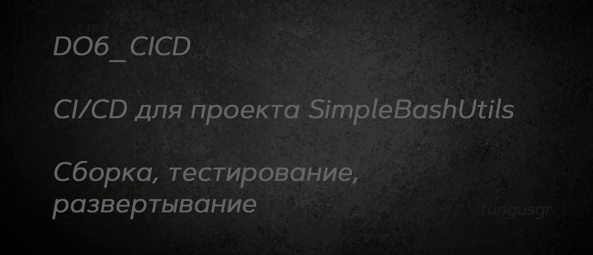  


## Содержание DO6_CICD  

* [Основы CI/CD](#основы-cicd)   
* [Реализованные требования к проекту](#реализованные-требования-к-проекту)  
* [Настройка gitlab-runner](#часть-1-настройка-gitlab-runner)   
* [Сборка](#часть-2-сборка)   
* [Тест кодстайла](#часть-3-тест-кодстайла)    
* [Интеграционные тесты](#часть-4-интеграционные-тесты)   
* [Этап деплоя](#часть-5-этап-деплоя)   
* [Дополнительно. Уведомления](#часть-6-дополнительно-уведомления)  
* [Материалы, прочитанные и просмотренные, во время и для выполнения задания](#материалы-прочитанные-и-просмотренные-во-время-и-для-выполнения-задания)   


## Основы **CI/CD**

Увы... Если что-то постоянно делается «вручную» – это либо будет работать плохо, либо вовсе не будет.

**CI/CD** — Это набор принципов и практик, которые позволяют чаще и надежнее развертывать изменения программного обеспечения.

Причины применения **CI/CD**:
- Командная разработка;
- Длинный жизненный цикл ПО;
- Сокращение релизного цикла;
- Сложность развертывания и тестирования крупных систем;
- Человеческий фактор.

**CI/CD** pipeline - это последовательность действий (скриптов) для определенной версии кода в репозитории, которая запускается автоматически при совершении изменений.

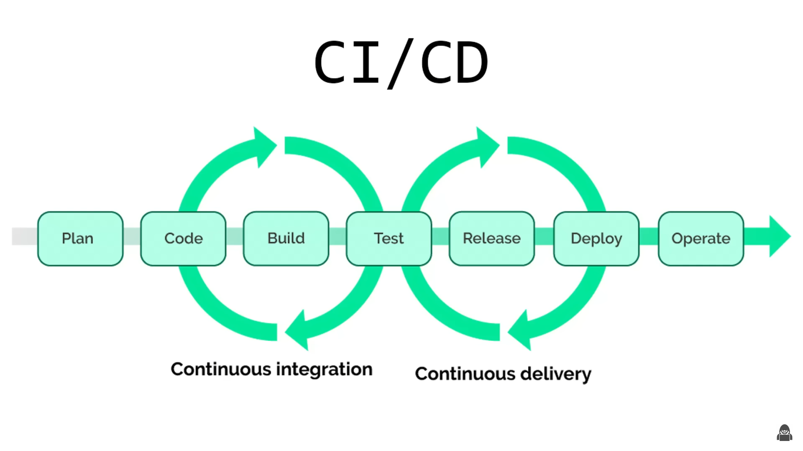   


### Основы **CI**

**CI** (Continuous Integration) — в дословном переводе «непрерывная интеграция».
Имеется в виду интеграция отдельных кусочков кода приложения между собой.
**CI** обычно выполняет две задачи, описанные далее.

- BUILD
    - Проверяем, собирается ли вообще код;
    - Готовим артефакты для следующих стадий;

- TEST
    - Тесты кодстайла;
    - Модульные тесты;
    - Интеграционные тесты;
    - Прочие тесты, которые у тебя есть;
    - Отчеты о тестах.


### Основы **CD**

**CD** (Continuous Delivery) — это расширение непрерывной интеграции, поскольку оно автоматически развертывает все изменения кода в тестовой и/или производственной среде после этапа сборки.  
**CD** может выполнять задачи, описанные далее.

- PUBLISH (В случае применения докера для развёртывания):
    - Собираем образы контейнеров;
    - Пушим образы туда, откуда их будем потом брать для развертывания;
- UPDATE CONFIGS:
    - Обновляем конфигурацию на машинах;
- DEPLOY STAGING:
    - Развертывание тестовой среды для ручных тестов, QA, и прочих не автоматизируемых проверок;
    - Может запускаться как вручную, так и автоматически при успешном прохождении стадий CI;
- DEPLOY PRODUCTION:
    - Разворачиваем новую версию системы на «продакшн»;
    - Этот этап желательно запускать вручную, а не автоматически;
    - По желанию можно настроить только для определенной ветки репозитория (master, release и т.п.).  

Артефакты в контексте CI/CD представляют собой файлы или данные, сгенерированные или использованные в процессе сборки, тестирования и развётки программного обеспечения. Эти артефакты могут включать в себя скомпилированный код, исполняемые файлы, библиотеки, документацию, отчеты о тестировании, конфигурационные файлы и многие другие элементы, созданные в ходе автоматизированных процессов CI/CD. Артефакты обычно сохраняются после успешной сборки проекта и могут использоваться для дальнейшего тестирования, поставки или развертывания приложения. Конечная цель артефактов - обеспечить надежную и документированную основу для планомерных этапов CI/CD.    


## Реализованные требования к проекту

Добавил в корень проекта файл README.md, содержащий подробную информацию по заданию в виде отчёта-реферата  
Сохранил два дампа образов виртуальных машин, описанных далее    
**P.S. Ни в коем случае не сохранял дампы в гит))**


## Буфер в терминале ВМ и копирование файлов между машинами

Это не часть задания: сделал это в процессе тестирования разных вариантов    

<details>
  <summary>Проброс порта: передача файлов и буфер</summary>
</p>

Пробросил порты с хостовой ОС на ВМ по инструкции [отсюда](https://lumpics.ru/port-forwarding-in-virtualbox/)   

  

Для копирования файлов с хоста на ВМ можно использовать команду scp  

Для тестирования проекта на ВМ и выявления зависимостей скопировал папку `src` на первую виртуальную машину командой, ввёденной в терминале именно(!) хостовой ОС: 
- `scp -r -P 12345 D:\Virtual_maschines\DO6_CICD fungusgr@127.0.0.1:.`     

  

<details>
  <summary>Подробное руководство по пробросу порта</summary>
</p>
 

**Проброс порта (Port Forwarding)**  
В настройках виртуальной машины выберите вкладку `Network`.  
Выберите первый адаптер и удостоверьтесь, что тип подключения - NAT. Раскройте `Advanced` и выберите `Port Forwarding`.
Нажмите на значок "+" для создания нового правила. Укажите `Host Port` - любой доступный порт на вашем хост-компьютере, например, 12345, и `Guest Port"`- порт 22 (по умолчанию используется SSH).   

**Установка SSH сервера на виртуальной машине**  
Установите SSH сервер на виртуальной машине с помощью команды: `sudo apt-get install openssh-server`  
Убедитесь, что SSH сервер запущен с помощью команды: `service ssh status`  

**Подключение по SSH к виртуальной машине**  
Используя терминал или другое удобное для вас приложение на вашей основной машине, подключитесь к виртуальной машине через SSH: `ssh -p 12345 user1@127.0.0.1`  
В случае первого подключения вас могут попросить подтвердить безопасность соединения.
Введите пароль учетной записи пользователя виртуальной машины, который вы устанавливали при создании VM.

**Передача файлов через SCP**
Чтобы передать файл с вашей основной машины на виртуальную, используйте команду scp: `scp -P 12345 file1.txt user1@127.0.0.1:existing_folder_inside_vm/file1.txt`   
В данной команде `file1.txt` - ваш файл для передачи, `existing_folder_inside_vm` - путь к папке внутри виртуальной машины, куда вы хотите сохранить файл.  

</p>
</details>

</p>
</details>


<details>
  <summary>Копирование файлов между машинами</summary>
</p>

Добавил сеть в "Адаптер 2" для обеих машин   
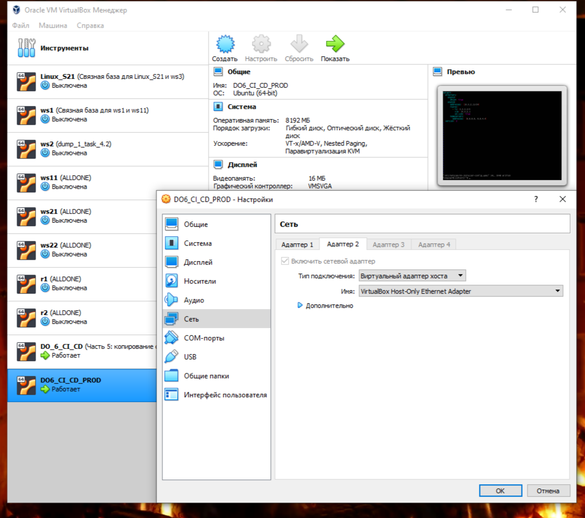 

Поднял новые сетевые интерфейсы `sudo ip link set enp0s8 up`   
Назначил ip адреса командами `sudo ip addr add 10.0.2.10/24 dev enp0s8` и `sudo ip addr add 10.0.2.11/24 dev enp0s8`  
Теперь у тестовой ВМ адрес 10.0.2.10, а у ВМ-продашна 10.0.2.11    
   
 
Проверил копирование с "тестовой ВМ" на "продакшн ВМ" командой `scp -r /home/fungusgr/test fungusgr@10.0.2.11:/home/fungusgr/`  
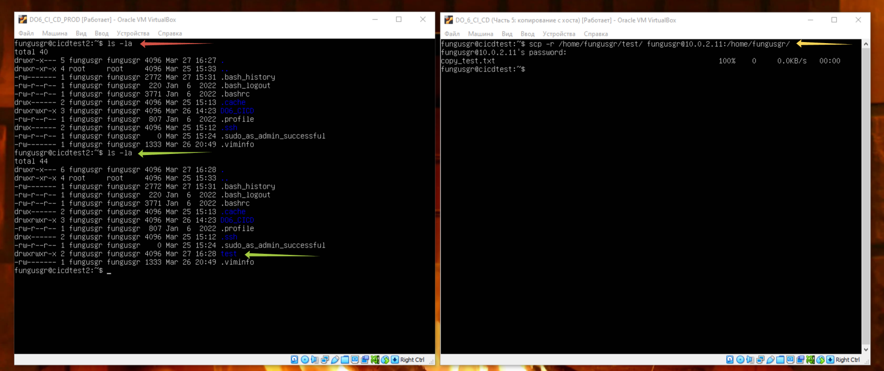   

<details>
  <summary>Использование SCP (Secure Copy)</summary>
</p>

Скопируйте файл с первой машины на вторую: Выполните команду SCP на первой машине, чтобы скопировать файл на вторую машину.   
Например: `scp /path/to/your/file username@10.0.2.11:/path/to/destination/`  

В этой команде:  
`/path/to/your/file` - путь к файлу, который вы хотите скопировать.  
`username` - ваше имя пользователя на второй машине.  
`10.0.2.11` - IP-адрес второй машины.  
`/path/to/destination/` - путь назначения на второй машине, куда вы хотите скопировать файл.  
Введите пароль: после успешного ввода файл будет скопирован.  

</p>
</details>

</p>
</details>


## Часть 1. Настройка **gitlab-runner**

<details>
  <summary>Развернуть отчёт</summary>
</p>

Скачал образ ОС [отсюда](https://ubuntu.com/download/server)  
Поднял виртуальную машину *Ubuntu Server 22.04 LTS* с именем `cicdtest`    
Вывел информацию о системе командой `cat /etc/os-release`  

  

Скачал и установил *gitlab-runner* на виртуальную машину командами
- `curl -L "https://packages.gitlab.com/install/repositories/runner/gitlab-runner/script.deb.sh" | sudo bash`   
- `sudo apt-get install gitlab-runner`    

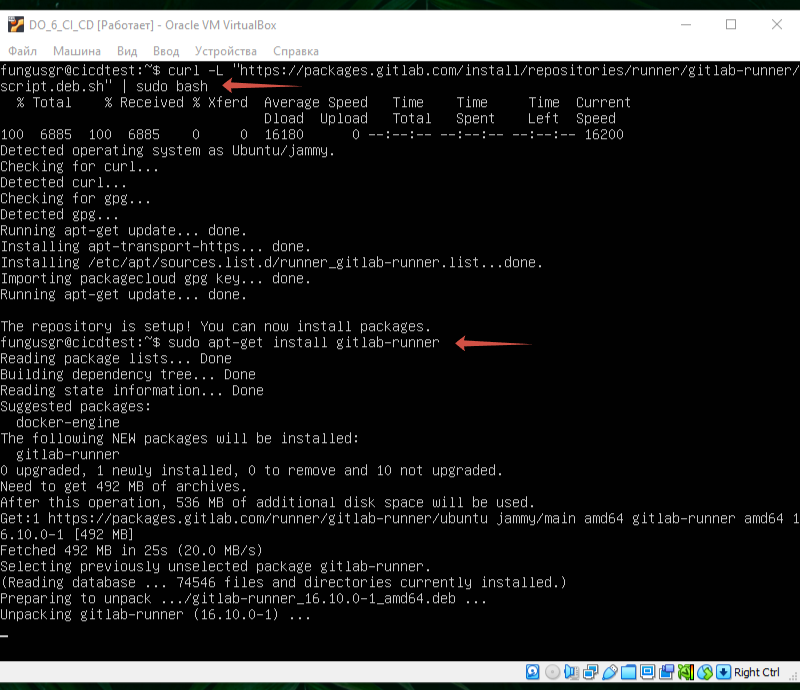   

Запустил *gitlab-runner* и зарегистрировал его для использования в текущем проекте *DO6_CICD* командой `sudo gitlab-runner register`   
Перезапустил для применения изменений `sudo systemctl restart gitlab-runner`  

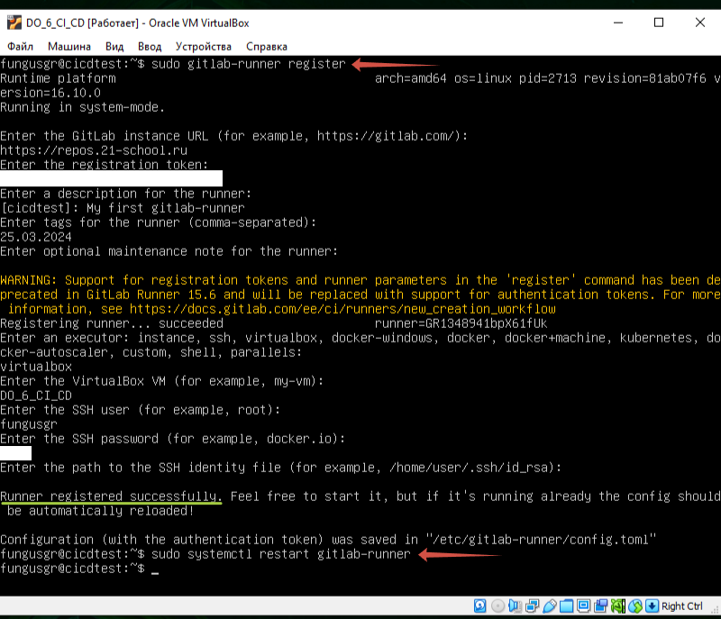  

Убедился, что сервис активен   

  

Установил на ВМ зависимости для работы с проектом:    

```bash
#!/bin/bash

sudo apt install make -y 				# Установка make
sudo apt install gcc -y 				# Установка gcc
sudo apt install g++ -y 				# Установка g++
sudo apt install valgrind -y 			# Установка valgrind
sudo apt install clang -y 				# Установка clang
sudo apt install libpcre3-dev -y 		# Установка libpcre3-dev
sudo apt install sshpass -y 			# Установка sshpass
```

</p>
</details>


## Часть 2. Сборка

<details>
  <summary>Развернуть отчёт</summary>
</p>

Напиcал этап для *CI* по сборке приложений из проекта *C3_SimpleBashUtils*:     
- добавил этапы запуска сборки через мейк файл для каждого приложения   
- файлы, полученные после сборки (артефакты), сохраняю в одноимённые директории со сроком хранения 30 дней   


```yml

image: gcc:latest
#  используется образ компилятора GCC для сборки проекта

stages:
  - build

# задание для сборки
build:
  stage: build
  script:
    - cd src/cat
    - make
    - cd ../grep
    - make
  artifacts:
    paths:
      - src/cat/
      - src/grep/
    expire_in: 30 days

```

Запушил изменения и проверил пайплайн   

  
 
</p>
</details>


## Часть 3. Тест кодстайла

<details>
  <summary>Развернуть отчёт</summary>
</p>

Напиcал этап для *CI*, который запускает скрипт проверки кодстайла (*clang-format*):  
- если кодстайл не прошел, то пайплайн «фейлится»  
- в пайплайне отобразил вывод утилиты *clang-format*  

Для этого добавил в мой файл `.gitlab-ci.yml`   

```yml

# задание для теста стиля кода
style:
  stage: style
  script:
    - cd src/cat
    - -f tests/style_test.log || touch tests/style_test.log
    - make style_test | tee tests/style_test.log
    - if grep -q "не соответствует стилю форматирования" tests/style_test.log; then exit 1; fi
    - |
    - cd ../grep
    - -f unit_tests/style_test.log || touch unit_tests/style_test.log
    - make style_test | tee unit_tests/style_test.log
    - if grep -q "не соответствует стилю форматирования" unit_tests/style_test.log; then exit 1; fi

```

<details>
  <summary>Пример удачной сборки</summary>
</p>
  
   
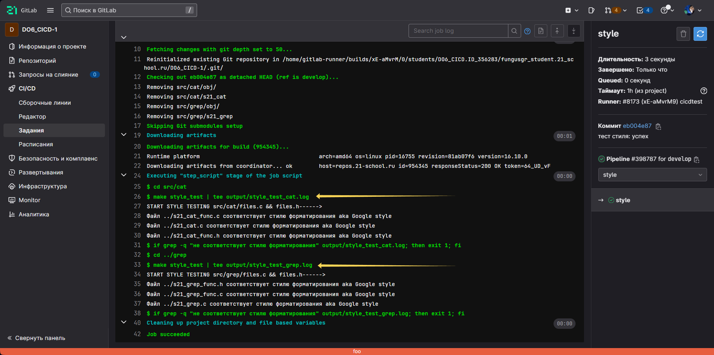  

</p>
</details>  

<details>
  <summary>Пример неудачной сборки</summary>
</p>
 
   
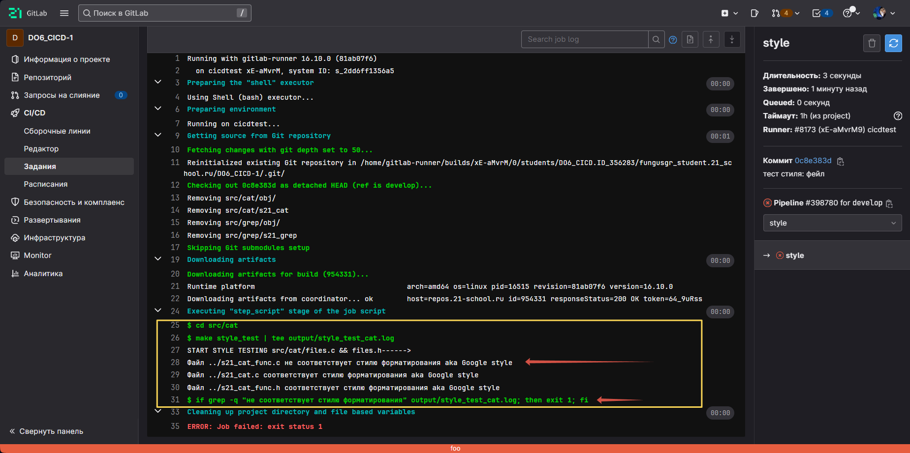   

</p>
</details>

</p>
</details>


## Часть 4. Интеграционные тесты

<details>
  <summary>Развернуть отчёт</summary>
</p>

Написал этап для **CI**, который запускает интеграционные тесты:  
- этот этап запускается только если сборка и тест кодстайла прошли успешно  
- если тесты не прошли, то пайплайн «фейлится»   
- в пайплайне отобразил вывод, что интеграционные тесты успешно прошли / провалились  

```yml

# задание для интеграционного тестирования
integration_test:
  stage: integration_test
  script:
    - |
      cd src/cat
      make test | tee tests_result.log
      if grep -q "FAIL: 0" tests_result.log; then
        echo "Интеграционные тесты cat прошли успешно!"
      else
        echo "Интеграционные тесты cat не прошли!"
        exit 1
      fi
    - |  
      cd ../grep
      make test | tee tests_result.log
      if grep -q "FAIL: 0" tests_result.log; then
        echo "Интеграционные тесты grep прошли успешно!"
      else
        echo "Интеграционные тесты grep не прошли!"
        exit 1
      fi
  dependencies:
    - build
    - style
  when: on_success

```

  
  
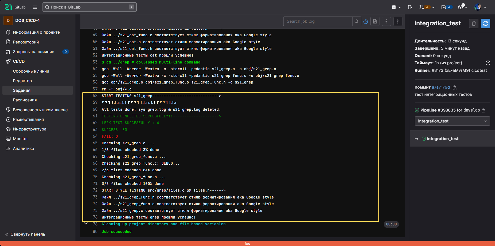  
 
</p>
</details>


## Часть 5. Этап деплоя

<details>
  <summary>Копирование на продакшн</summary>
</p>

Поднял вторую виртуальную машину *Ubuntu Server 22.04 LTS* с именем `cicdtest2` клонированием  

*Первая ВМ у нас выполняет роль тестовой машины, в среде которой разворачивается и тестируется наше приложение*  
*Вторая ВМ играет роль продакшна: на эту ВМ загружаются данные проекта, прошедшие все тесты в пайплайне*  
*Откуда не была бы сделана попытка пуша, код сначала будет загружаться на тестовую ВМ, на которой будет разворачиваться и тестироваться пайплайн.*  
*И только в случае успеха, код будет переноситься на вторую ВМ, играющую роль продакшна.*    


Из-за того, что вторую ВМ поднимал клонированием у нёё такой же внешний ip как у тестовой.  
Исправил это изменив тип Адаптера-1 с NAT на Виртуальный адаптер хоста.  

   


Работу выполняет gitlab-runner через своего одноименного пользователя, поэтому:     
- на ВМ где запущен runner сменил пользователя командой `sudo su gitlab-runner`   
- сгенерировал ssh ключ `ssh-keygen -t rsa -b 2048`  
- добавил его в файл /.ssh/authorized_keys на прод-ВМ командой `ssh-copy-id fungusgr@192.168.56.101`  
- поменял пользователя обратно командой `su - fungusgr`  

На Прод-ВМ:  
- сделал пользователя *fungusgr* владельцем папки назначения для скрипта командой `sudo chown -R fungusgr /usr/local/bin/`  

   


Написал этап для **CD**, который «разворачивает» проект на другой виртуальной машине:
- этот этап запускается вручную при условии, что все предыдущие этапы прошли успешно   
- написал bash-скрипт, который при помощи **ssh** и **scp** копирует артефакты, в директорию */usr/local/bin* второй виртуальной машины  
- добавил в _gitlab-ci.yml_ этап запуска написанного скрипта в deploy   
- в случае ошибки переноса файлов пайплайн «фейлится»   


```bash

#!/bin/bash

HOST="192.168.56.101"
USER="fungusgr"
TMP_DIR="/home/fungusgr"
DEST_DIR="/usr/local/bin"


# Копирование артефактов на Прод-ВМ через scp
scp -r src/cat $USER@$HOST:$TMP_DIR
scp -r src/grep/ $USER@$HOST:$TMP_DIR

# Проверка успешности копирования
if [ $? -eq 0 ]; then
    echo "Артефакты успешно скопированы на Прод-ВМ"
else
    echo "Ошибка при копировании артефактов на Прод-ВМ"
    exit 1
fi


# Перенос файлов в папку назначения через ssh
ssh $USER@$HOST "
				  rm -rf /usr/local/bin/cat; 
				  rm -rf /usr/local/bin/grep;
				  mv $TMP_DIR/cat $DEST_DIR; 
				  mv $TMP_DIR/grep $DEST_DIR
				" 

# Проверка успешности перемещения
if [ $? -eq 0 ]; then
    echo "Файлы успешно перемещены в папку назначения."
else
    echo "Ошибка при перемещении файлов в папку назначения."
    exit 1
fi


```

```yml

# задание для деплоя на прод
deploy:
  stage: deploy
  script:
    - ./ci/deploy_script.sh
  dependencies:
    - build
    - style
    - integration_test
  when: manual

```

В результате я получил готовые к работе приложения из проекта *C2_SimpleBashUtils* на Прод-ВМ    

  
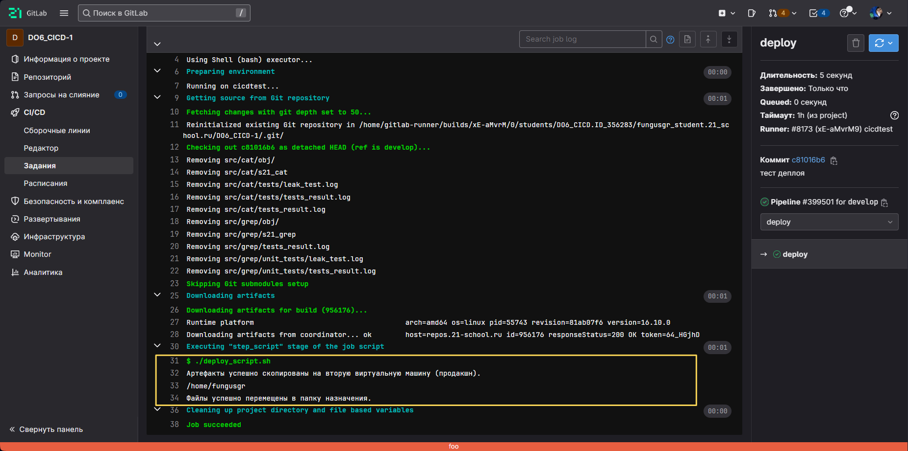  
  


Сохранил дампы образов виртуальных машин  

 
</p>
</details>

</p>
</details>


## Часть 6. Дополнительно. Уведомления

<details>
  <summary>Развернуть отчёт</summary>
</p>


Для активации уведомлений о пайплайне в Telegram через бота "AEON_IX DO6 CI/CD", сделал:  
- нашёл бота с именем BotFather в Telegram и создал нового бота, следуя инструкциям  
- получил API-ключ для взаимодействия с ботом  
- узнал свой телеграм ID открыв в веб-версии "Сохранённые сообщения"   

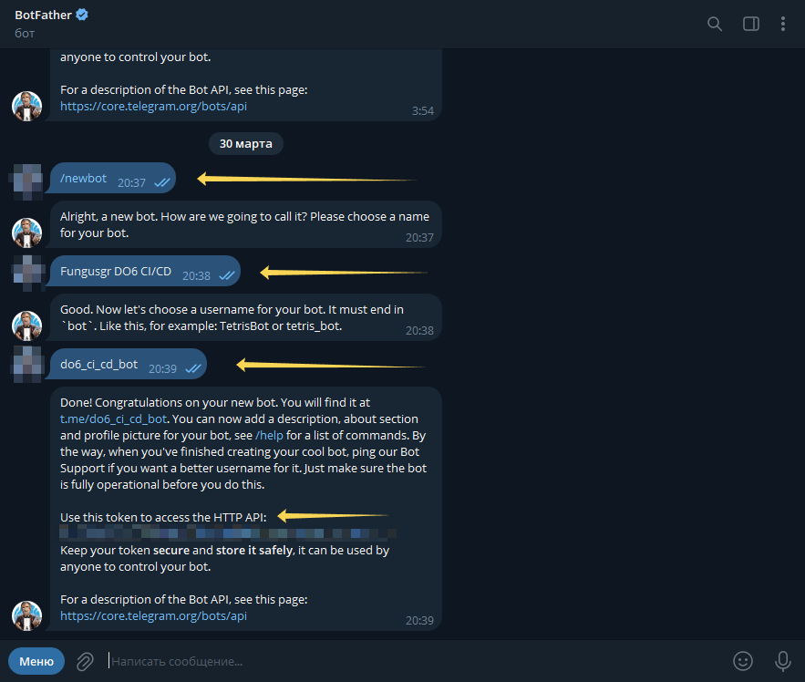  


Создал файл скрипта и дал ему права на исполнение `chmod +x telegram_notifications.sh`    

```bash

BOT_TOKEN="$ENV_TOKEN" # можно создать переменную окружения и записать в неё значение токена, которую в скрипте считывать из переменной (да, в контейнере это было бы проще)
CHAT_WITH_USER_ID="А ТУТ АЙДИ ПОЛЬЗОВАТЕЛЯ КОМУ ПИСАТЬ"

if [ "$CI_JOB_STATUS" == "success" ]; then
  MESSAGE="$CI_JOB_STAGE ✅"
else
  MESSAGE="$CI_JOB_STAGE 🚫"
fi

curl -s -X POST https://api.telegram.org/bot${BOT_TOKEN}/sendMessage -d chat_id=${CHAT_WITH_USER_ID} -d text="${MESSAGE}" -d parse_mode="html"

# переменные начинающиеся с "CI_" - это глобальные переменные gitlab-runner, список тут https://docs.gitlab.com/ee/ci/variables/predefined_variables.html 

```

Изменил конфигурацию .gitlab-ci.yml  

```yml
stages:
  - notify

build:
  after_script:
    - ./ci/telegram_notifications.sh  # Задание для отправки уведомлений о статусе пайплайна

style:
  after_script:
    - ./ci/telegram_notifications.sh  

integration_test:
  after_script:
    - ./ci/telegram_notifications.sh  

send_notification:
  stage: notify
  script:
    - ./ci/notifications_result.sh  
  dependencies:
    - build
    - style
    - integration_test
  when: on_success

deploy:
  after_script:
    - ./ci/telegram_notifications.sh  

```


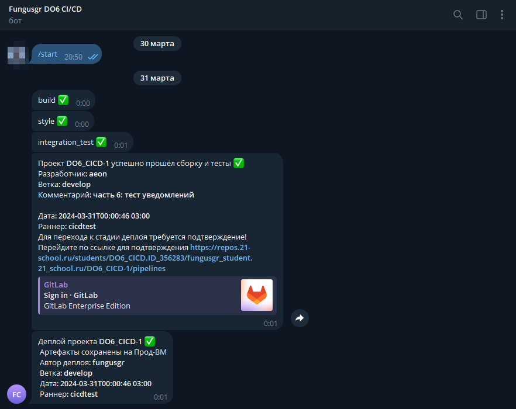  
 
</p>
</details>


## Материалы, прочитанные и просмотренные, во время и для выполнения задания  

   ### CI/CD      
   [CI/CD Введение](https://doka.guide/tools/ci-cd/)   
   [Что такое CI/CD](https://habr.com/ru/companies/otus/articles/515078/)   
   [CI/CD Наглядные примеры](https://yandex.ru/video/preview/9074646264195759555)   
   [Настройка общих папок в VirtualBox](https://lumpics.ru/set-up-virtualbox-shared-folders-in-linux/)    
   [Определение и настройка проброса портов в VirtualBox](https://lumpics.ru/port-forwarding-in-virtualbox/)   
   [Пайплайн CI/CD: что это такое, как применяется в разработке](https://timeweb.cloud/tutorials/ci-cd/pajplajn-ci-cd-chto-ehto-takoe)   
   [Руководство по CI/CD в GitLab для (почти) абсолютного новичка](https://habr.com/ru/articles/498436/)   
   [Что такое CI/CD и как эта практика связана с DevOps и облаками](https://yandex.cloud/ru/blog/posts/2022/10/ci-cd)   
   [Настройка CI/CD в GitLab для синхронизации проекта с веб-серверами](https://www.dmosk.ru/miniinstruktions.php?mini=gitlab-runner-web)   

   ### Telegram  
   [GitLab CI & Telegram](https://ifedyukin.ru/blog/all/gitlab-ci-telegram/)   
   [Как узнать chat_id Telegram без ботов и кода?](https://pikabu.ru/story/kak_uznat_identifikator_telegram_kanalachatagruppyi_kak_uznat_chat_id_telegram_bez_botov_i_koda_11099278)   
   [Справочник по предопределенным переменным CI/CD](https://docs.gitlab.com/ee/ci/variables/predefined_variables.html)   
   [Используем Telegram Bot API для уведомлений от сервера](https://snnkv.com/articles/telegram-bot-notifications/)   


[💡 Нажми сюда](https://forms.yandex.ru/cloud/641819b3c09c022518e7a4f3/), **чтобы поделиться с нами обратной связью на этот проек**т.   
Это анонимно и поможет команде Продукта сделать твоё обучение лучше.  
